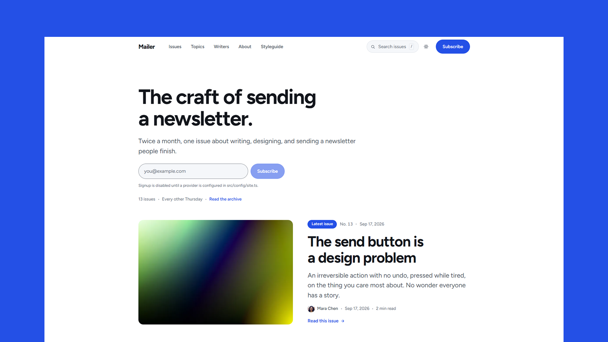

# Mailer - Astro Newsletter Theme

[](https://mailer.xocoweb.workers.dev/)

[](https://astro.build/)
[](https://tailwindcss.com/)
[](https://www.typescriptlang.org/)
[](./LICENSE)

**Live preview:** https://mailer.xocoweb.workers.dev/

Mailer is a free Astro theme for a newsletter with a public archive. Issues are numbered, the archive reads as a numbered index rather than a wall of cards, and the front page is dealt from that archive: the latest issue leads at full width, the next two run as cards, and everything after them falls into the index. Nothing repeats between blocks, and any block with nothing to show hides itself, so a site with three issues and a site with three hundred both look deliberate.

Content is Markdown or MDX validated by Astro content collections — a missing excerpt or an unknown topic fails the build instead of shipping. Search runs client-side against a statically generated index with no service to sign up for, the signup form posts to any provider that accepts a POST, and site identity, topics, and writers come from three config files, so the whole publication can be renamed without touching a component.

## Features

- Numbered issues in Markdown or MDX, validated by Astro content collections — issue number, title, excerpt, topic, date, writer, cover with alt text and photo credit, featured and draft flags
- A front page assembled from the archive with no repeats between blocks: a masthead with the signup form, a full-width lead issue, two recent issues as cards, a numbered index of back issues, a topic grid, and a writer row, every block hiding itself when it has nothing to show
- An archive that reads as a numbered index grouped by year, with the issue number in its own column, so the shape of a publication is legible at a glance
- Issue pages with a fixed reading column, a reading-progress bar, a writer note, and previous/next issue navigation
- Six blocks for the issue body handed to MDX with no import needed — callouts in six tones, toggles, bookmark cards that fill themselves in from the linked page's Open Graph tags at build time, an audio card, a file download, and a figure with a caption, a linked photo credit, and an optional wide break-out past the reading column
- A lightbox on every issue with arrow keys, swipe, a counter, and neighbours preloaded, wired up at runtime so plain Markdown images get it too
- A styleguide page showing every block in the reading column, with the props each one takes
- A provider-neutral signup form that posts to any endpoint — Buttondown, Kit, Mailchimp, Listmonk, your own handler — and renders disabled until it is configured, so a half-finished setup never silently eats an address
- Client-side search over a statically generated JSON index with no service and no API key, shared by a header dialog (`Ctrl`/`Cmd` `K`) and a results page whose query lives in the URL
- Issue, archive, topic, topic index, writer, writer index, search, about, privacy, styleguide, and 404 pages, with archive, topic, and writer paginated through one index component
- A share card with eleven targets, a long tail behind "More", and a copy-link field, handing off to the device's own share sheet where there is one
- A header that gets out of the way on the way down the page and returns on the way up, with a full-width mobile drawer below 56rem carrying trapped focus and Escape
- One feed at `/rss.xml` carrying full issue content rendered through Astro's container, with summary-only feeds and the item cap one setting each
- Read time counted from the issue body at build time, and drafts excluded from every listing, feed, and search index
- Light and dark syntax-highlighted code blocks, styled lists, blockquotes and figures, and wide tables given their own scroll frame instead of dragging the page sideways
- Site identity, SEO defaults, locale, reading speed, cadence, editor byline, socials and navigation in `src/config/site.ts`; topics in `src/config/topics.ts`; writer portraits and bios in `src/config/writers.ts`
- Canonical URLs, sitemap, RSS, `robots.txt`, Open Graph, Twitter/X cards, and JSON-LD — `BlogPosting` with issue number, word count and read time, a `BreadcrumbList` on every issue, and `WebSite` with a search action — plus share cards cropped from each cover at build time
- Static output with no framework islands to hydrate; JavaScript only for search, the menu, theme switching, sharing, the lightbox, and the progress bar
- Responsive Astro images with Sharp, eager loading limited to above-the-fold covers, and one self-hosted variable typeface with no external font requests
- Skip link, landmarks, labelled controls, visible focus states, one tab stop per index row, and full `prefers-reduced-motion` support
- System-aware light and dark modes with a saved reader preference

## Tech Stack

- Astro 7
- Tailwind CSS 4 via the Vite plugin
- Vite 8
- TypeScript
- Astro content collections
- `@astrojs/sitemap` and `@astrojs/rss`
- Sharp for image processing

## Requirements

- Node.js `22.12.0` or newer
- npm

## Getting Started

```bash
npm install
npm run dev
```

Build for production:

```bash
npm run build
```

Preview the production build locally:

```bash
npm run preview
```

## Customization

See [CUSTOMIZATION.md](./CUSTOMIZATION.md) for site settings, topics, writers, the signup form, frontmatter, images and the lightbox, the blocks an issue can carry, sharing, pages, search, fonts, and theme tokens.

## Content

Issues live in [src/content/issues](./src/content/issues). Each issue is a folder with an `index.md` (or `index.mdx`) and a `cover.jpg`. Frontmatter is validated by the schema in [src/content.config.ts](./src/content.config.ts).

The bundled demo images are gradients from [Pexels](https://www.pexels.com/) under the Pexels License; each issue credits its photographer in frontmatter. Replace them with your own imagery before publishing.

Writer portraits live in [src/config/writers.ts](./src/config/writers.ts), keyed by the `author.name` used in issue frontmatter, with the images in `src/assets/writers`. Names with no entry fall back to a monogram avatar. The bundled portraits are Unsplash placeholders — the people photographed have no connection to these fictional bylines, so swap in photos of your real contributors before publishing.

## Support

Mailer is free and provided as-is. Bug reports and questions are welcome as GitHub issues; custom
design and feature work is not included.

## License

MIT — free for personal and commercial projects. See [LICENSE](./LICENSE), which also lists the
licenses of the bundled fonts, icons, and demo images.
